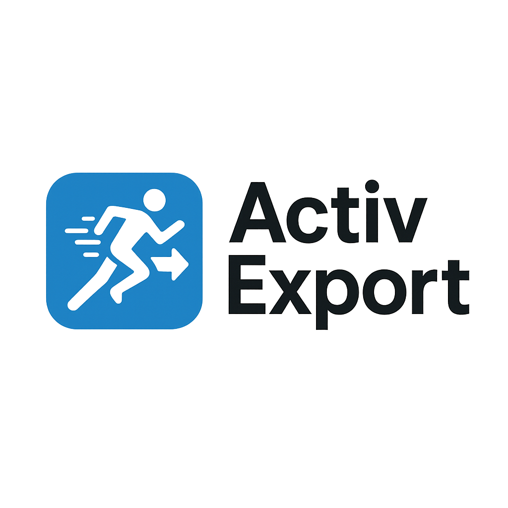

# ActivExport - Outil d'Extraction d'Activités Strava

<p align="center">
  
</p>

**Version :** 2.0
**Date :** Décembre 2025
**Auteur :** Benoit Boucher

Outil Python pour récupérer et analyser vos activités Strava via l'API officielle.
Exportez vos données dans plusieurs formats : JSON, CSV et Markdown.

---

## 📋 Table des Matières

1. [Prérequis](#prérequis)
2. [Installation](#installation)
3. [Configuration](#configuration)
4. [Utilisation](#utilisation)
5. [Formats de Sortie](#formats-de-sortie)
6. [Scripts Disponibles](#scripts-disponibles)
7. [Structure du Projet](#structure-du-projet)
8. [Résolution de Problèmes](#résolution-de-problèmes)

---

## 🔧 Prérequis

### 1. Environnement Technique

**Python**
- Version : Python 3.7 ou supérieur
- Vérifier : `python --version`

**Modules Python Requis**
- `requests` : Requêtes HTTP vers l'API Strava
- `python-dotenv` : Gestion variables d'environnement

Ces modules seront installés automatiquement via `requirements.txt`.

### 2. Compte Strava

- Avoir un compte Strava actif
- Avoir des activités enregistrées sur Strava

### 3. Accès Internet

- Nécessaire pour communiquer avec l'API Strava
- Port 8000 local disponible (pour OAuth callback)

---

## 📥 Installation

### Étape 1 : Cloner/Télécharger le Projet

Placer le répertoire `activexport/` où vous le souhaitez.

```
activexport/
├── .env.example                        # Modèle fichier configuration
├── .gitignore                          # Fichiers à ignorer (Git)
├── requirements.txt                    # Dépendances Python
├── activexport_providers.py            # Config/helpers partagés multi-providers (OAuth2)
├── activexport_auth.py                 # Script authentification
├── activexport_fetch_activities.py     # Récupération activités
├── activexport_get_activity_details.py # Détails activité
└── README.md                           # Cette documentation
```

### Providers Supportés

ActivExport supporte 2 providers, sélectionnables via l'option `--provider` (défaut : `strava`) :

| Provider | Valeur du flag | Remarques |
|----------|-----------------|-----------|
| Strava | `strava` (défaut) | Nécessite un **abonnement Strava payant actif** sur le compte propriétaire de l'application (politique Strava depuis juin 2026). |
| Decathlon Coach | `decathcoach` | API "Sports Tracking Data" gratuite, nécessite une inscription préalable (voir plus bas). |

### Étape 2 : Installer les Dépendances Python

```bash
cd activexport
pip install -r requirements.txt
```

**Vérification :**
```bash
python -c "import requests; import dotenv; print('OK')"
```

Si "OK" s'affiche, les modules sont correctement installés.

---

## ⚙️ Configuration

### Étape 1 : Créer une Application Strava

**1. Accéder au portail développeur**

Aller sur : https://www.strava.com/settings/api

Vous devez être connecté à votre compte Strava.

**2. Créer l'application**

Cliquer sur **"Create an App"** et remplir :

| Champ | Valeur Recommandée |
|-------|-------------------|
| **Application Name** | `Running Analysis Tool` (ou votre nom) |
| **Category** | `Data Importer` ou `Visualizer` |
| **Club** | Laisser vide (ou votre club) |
| **Website** | `http://localhost` |
| **Application Description** | `Analyse personnelle données course` |
| **Authorization Callback Domain** | `localhost` ⚠️ IMPORTANT |

⚠️ **Note importante :** Le champ "Authorization Callback Domain" doit être exactement `localhost` (sans http://, sans port).

**3. Accepter les conditions**

- Cocher "I agree to Strava API Agreement"
- Cliquer sur **"Create"**

**4. Récupérer vos Identifiants**

Après création, Strava affiche :

```
Client ID:          [un nombre, ex : 123456]
Client Secret:      [une chaîne alphanumérique]
```

⚠️ **IMPORTANT :**
- Noter ces 2 valeurs soigneusement
- NE JAMAIS les partager publiquement
- Elles sont personnelles et confidentielles

---

### Étape 2 : Configurer le Fichier `.env`

**1. Créer le fichier `.env`**

Dans le répertoire `activexport/`, créer un fichier nommé `.env` (sans extension).

**Sur Windows :**
```bash
copy NUL .env
```

**Sur Linux/Mac :**
```bash
touch .env
```

**2. Éditer le fichier `.env`**

Ouvrir `.env` avec un éditeur de texte et ajouter :

```bash
# Identifiants API Strava
# ⚠️ NE JAMAIS COMMITER CE FICHIER SUR GIT

STRAVA_CLIENT_ID=VOTRE_CLIENT_ID
STRAVA_CLIENT_SECRET=VOTRE_CLIENT_SECRET

# Les tokens seront ajoutés automatiquement après la première authentification
STRAVA_ACCESS_TOKEN=
STRAVA_REFRESH_TOKEN=
STRAVA_TOKEN_EXPIRES_AT=
```

Remplacer :
- `VOTRE_CLIENT_ID` par le Client ID fourni par Strava
- `VOTRE_CLIENT_SECRET` par le Client Secret fourni par Strava

**Exemple (valeurs fictives) :**
```bash
STRAVA_CLIENT_ID=123456
STRAVA_CLIENT_SECRET=abc123def456ghi789jkl012mno345pqr678stu90
```

**3. Sauvegarder**

Le fichier `.env` est automatiquement protégé par `.gitignore`.

---

### Étape 1bis : Application Decathlon Coach (optionnel, pour `--provider decathcoach`)

**1. Demander l'accès à l'API**

Remplir [ce formulaire d'inscription](https://forms.gle/4WKN7ihQBpyzMt389). Decathlon valide la demande et fournit, si acceptée :
- une **API key**
- un **Client ID** et **Client Secret** pour Decathlon Login (OAuth2)

**2. Ajouter les identifiants dans `.env`**

```bash
DECATHLON_CLIENT_ID=VOTRE_CLIENT_ID
DECATHLON_CLIENT_SECRET=VOTRE_CLIENT_SECRET
DECATHLON_API_KEY=VOTRE_API_KEY
```

Référence : [documentation Sports Tracking Data API](https://github.com/Decathlon/sports-tracking-data-documentation).

---

### Étape 3 : Authentification Initiale

**1. Lancer le script d'authentification**

```bash
python activexport_auth.py
```

**2. Que va-t-il se passer ?**

Le script va :
1. Ouvrir votre navigateur automatiquement
2. Vous rediriger vers Strava pour autoriser l'application
3. Démarrer un serveur local (http://localhost:8000)
4. Attendre que vous acceptiez l'autorisation sur Strava

**3. Sur la page Strava**

- Vérifier les autorisations demandées :
  - `read` : Lire vos données publiques
  - `activity:read_all` : Lire toutes vos activités
  - `profile:read_all` : Lire votre profil complet
- Cliquer sur **"Authorize"**

**4. Succès**

Le navigateur affichera :
```
Strava authentication successful!
You can close this window and return to the terminal.
```

Dans le terminal :
```
============================================================
AUTHENTICATION SUCCESSFUL!
============================================================

Athlete: [Votre Nom]
Token expires at: [Date]

Tokens saved to: activexport_tokens.json
```

**5. Fichiers créés**

Un fichier `activexport_tokens.json` a été créé automatiquement. Il contient vos tokens d'accès.

⚠️ **NE JAMAIS partager ce fichier** (protégé par `.gitignore`).

---

### Étape 4 : Tester la Connexion

```bash
python activexport_auth.py test
```

**Résultat attendu :**
```
============================================================
STRAVA API CONNECTION TEST
============================================================

API connection successful!

Athlete Profile:
   Name: [Votre Nom]
   City: [Votre Ville]
   Country: France
   Weight: [Votre Poids] kg
   ...

API ready to fetch your activities!
```

✅ **Si ce message s'affiche, l'API est configurée !**

---

## 🚀 Utilisation

### Obtenir de l'Aide

Afficher l'aide pour n'importe quel script :

```bash
python activexport_fetch_activities.py --help
python activexport_get_activity_details.py --help
```

### Choisir un Provider

Tous les scripts acceptent une option `--provider` (`strava` ou `decathcoach`, défaut : `strava`). Authentifiez-vous et récupérez séparément par provider, par exemple :

```bash
python activexport_auth.py --provider decathcoach
python activexport_fetch_activities.py --provider decathcoach -f json
```

---

### 1. Récupérer Toutes vos Activités

#### Utilisation Basique (Affichage Uniquement)

```bash
python activexport_fetch_activities.py
```

**Ce que fait le script :**
- Récupère TOUTES vos activités depuis la création de votre compte Strava
- Affiche les statistiques globales à l'écran
- **Aucun fichier créé** (stdout uniquement)

**Exemple de sortie :**
```
============================================================
FETCHING STRAVA ACTIVITIES
============================================================

[Page 1] Fetching max 200 activities...
      -> 200 activities fetched
...
TOTAL: 1527 activities fetched

============================================================
ACTIVITY ANALYSIS
============================================================

Distribution by sport type:
   Run                 :  786 activities
   TrailRun            :  132 activities
   ...

Global statistics:
   Total distance: 15540.1 km
   Total elevation: 174412 m
   Total time: 1629.4 hours
```

---

#### Exporter vers des Fichiers

**Exporter en JSON :**
```bash
python activexport_fetch_activities.py -f json
```
Crée : `./output/activexport_activities_AAAAMMJJ_HHMMSS.json`

**Exporter en CSV :**
```bash
python activexport_fetch_activities.py -f csv
```
Crée : `./output/activexport_activities_AAAAMMJJ_HHMMSS.csv`

**Exporter en Markdown :**
```bash
python activexport_fetch_activities.py -f md
```
Crée : `./output/activexport_activities_AAAAMMJJ_HHMMSS.md`

**Exporter dans plusieurs formats :**
```bash
python activexport_fetch_activities.py -f json -f csv -f md
```
Crée les 3 fichiers simultanément.

---

#### Répertoire de Sortie Personnalisé

```bash
python activexport_fetch_activities.py -f json -o ./mes_exports/
```

Sauvegarde le fichier JSON dans `./mes_exports/` au lieu de `./output/`.

---

### 2. Rechercher des Activités par Nom

```bash
python activexport_fetch_activities.py "terme de recherche"
```

**Exemples :**

```bash
# Trouver tous les trails "Sancy"
python activexport_fetch_activities.py "sancy"

# Trouver toutes les sorties "Team RM"
python activexport_fetch_activities.py "Team RM"

# Rechercher et exporter en JSON
python activexport_fetch_activities.py "maines" -f json
```

**Exemple de sortie :**
```
3 activity(ies) found containing 'sancy':

   [24/09/2022] Trail du Sancy
      33.15 km - 2029 m elevation
      ID: 7812345678
   ...
```

Lors de l'utilisation de `-f`, seules les activités correspondantes sont exportées.

---

### 3. Récupérer les Détails d'une Activité

#### Utilisation Basique (Affichage Uniquement)

```bash
python activexport_get_activity_details.py <activity_id>
```

**Exemple :**
```bash
python activexport_get_activity_details.py 6018412458
```

**Sortie :**
```
============================================================
ACTIVITY DETAILS
============================================================

Name: Trail de la Digue
Date: 25/09/2021 10:00
Type: TrailRun
ID: 6018412458

METRICS:
   Distance: 51.00 km
   Elevation gain: 0 m D+
   Time: 06h04'20"
   Average pace: 7'08"/km

EQUIPMENT:
   HOKA Challenger ATR 5 (1041.5 km)
```

---

#### Exporter vers des Fichiers

**Exporter en JSON :**
```bash
python activexport_get_activity_details.py 6018412458 -f json
```
Crée : `./output/activity_6018412458.json`

**Exporter en Markdown :**
```bash
python activexport_get_activity_details.py 6018412458 -f md
```
Crée : `./output/activity_6018412458.md`

**Exporter dans les deux formats :**
```bash
python activexport_get_activity_details.py 6018412458 -f json -f md
```

**Répertoire de sortie personnalisé :**
```bash
python activexport_get_activity_details.py 6018412458 -f json -o ./mes_donnees/
```

---

## 📊 Formats de Sortie

### Format JSON

**Structure pour les activités :**
```json
{
  "metadata": {
    "export_date": "2025-12-05T19:30:00",
    "total_activities": 1527,
    "source": "Strava API v3"
  },
  "activities": [
    {
      "id": 6018412458,
      "name": "Trail de la Digue",
      "sport_type": "TrailRun",
      "distance": 51000,
      "total_elevation_gain": 0,
      "moving_time": 21860,
      ...
    }
  ]
}
```

**Cas d'usage :**
- Analyse de données avec Python/R
- Import dans des bases de données
- Datasets pour machine learning
- Traitement programmatique

---

### Format CSV

**Colonnes :**
```csv
date,name,type,distance_km,elevation_m,moving_time,elapsed_time,avg_pace,avg_hr,max_hr
2025-12-05,Morning Run,Run,10.5,120,3600,3720,5'43",145,165
2025-12-04,Trail,TrailRun,17.0,300,7920,8100,7'46",142,170
```

**Cas d'usage :**
- Ouvrir dans Excel/LibreOffice Calc
- Import dans Google Sheets
- Visualisation rapide des données
- Tableaux croisés dynamiques et graphiques

---

### Format Markdown

**Exemple pour liste d'activités :**
```markdown
# Strava Activities Export
**Generated:** 2025-12-05 19:30:00
**Total Activities:** 1527

## Summary Statistics
- **Total Distance:** 15,540.1 km
- **Total Elevation:** 174,412 m
- **Total Time:** 1,629.4 hours

## Activities by Sport Type
| Sport Type | Count |
|------------|-------|
| Run | 786 |
| TrailRun | 132 |

## Recent Activities
| Date | Name | Type | Distance | Elevation | Time |
|------|------|------|----------|-----------|------|
| 2025-12-05 | Morning Run | Run | 10.5 km | 120 m | 1h00' |
```

**Exemple pour détails d'activité :**
```markdown
# Activity Details: Trail de la Digue
**ID:** 6018412458
**Date:** 2021-09-25 10:00
**Type:** TrailRun

## Metrics
- **Distance:** 51.00 km
- **Elevation gain:** 0 m D+
- **Time:** 06h04'20"
- **Average pace:** 7'08"/km
```

**Cas d'usage :**
- Documentation
- Articles de blog
- GitHub READMEs
- Facile à lire et partager

---

## 📚 Scripts Disponibles

### `activexport_auth.py`

**Fonction :** Gestion authentification OAuth2

**Commandes :**
```bash
python activexport_auth.py        # Authentification initiale
python activexport_auth.py test   # Tester la connexion
```

**Fonctionnalités :**
- Ouvre le navigateur pour autorisation Strava
- Échange le code d'autorisation contre des tokens
- Rafraîchit automatiquement les tokens expirés
- Sauvegarde les tokens dans `activexport_tokens.json`

---

### `activexport_fetch_activities.py`

**Fonction :** Récupérer toutes les activités et exporter dans plusieurs formats

**Usage :**
```bash
python activexport_fetch_activities.py [OPTIONS] [RECHERCHE]
```

**Options :**
- `-h, --help` : Afficher le message d'aide
- `-f, --format FORMAT` : Format de sortie (json, csv, md). Peut être utilisé plusieurs fois
- `-o, --output DIR` : Répertoire de sortie (défaut : `./output`)
- `--provider {strava,decathcoach}` : Provider d'activités à utiliser (défaut : `strava`)

**Exemples :**
```bash
# Affichage uniquement (pas d'export)
python activexport_fetch_activities.py

# Exporter en JSON
python activexport_fetch_activities.py -f json

# Exporter dans tous les formats
python activexport_fetch_activities.py -f json -f csv -f md

# Rechercher et exporter
python activexport_fetch_activities.py "trail" -f json

# Répertoire de sortie personnalisé
python activexport_fetch_activities.py -f json -o ./mes_exports/
```

**Fonctionnalités :**
- Pagination automatique (200 activités/page)
- Gestion limites API (pause automatique)
- Export multi-formats : JSON, CSV, Markdown
- Analyse par type de sport
- Statistiques globales (distance, dénivelé, temps)
- Recherche par nom d'activité
- Répertoire de sortie personnalisable

---

### `activexport_get_activity_details.py`

**Fonction :** Détails complets d'une activité spécifique

**Usage :**
```bash
python activexport_get_activity_details.py ACTIVITY_ID [OPTIONS]
```

**Options :**
- `-h, --help` : Afficher le message d'aide
- `-f, --format FORMAT` : Format de sortie (json, md). Peut être utilisé plusieurs fois
- `-o, --output DIR` : Répertoire de sortie (défaut : `./output`)
- `--provider {strava,decathcoach}` : Provider d'activités à utiliser (défaut : `strava`)

**Exemples :**
```bash
# Affichage uniquement
python activexport_get_activity_details.py 6018412458

# Exporter en JSON
python activexport_get_activity_details.py 6018412458 -f json

# Exporter en JSON et Markdown
python activexport_get_activity_details.py 6018412458 -f json -f md

# Répertoire de sortie personnalisé
python activexport_get_activity_details.py 6018412458 -f json -o ./donnees/
```

**Données extraites :**
- Nom, date, type, ID
- Distance, dénivelé, temps
- Allure moyenne
- FC moyenne/max (si disponible)
- Altitude min/max
- Cadence
- Équipement utilisé
- Description/commentaires

---

## 📁 Structure du Projet

```
activexport/
├── .env                                # ⚠️ Identifiants (NE PAS COMMITER)
├── .env.example                        # Modèle .env
├── .gitignore                          # Protection fichiers sensibles
├── requirements.txt                    # Dépendances Python
├── activexport_tokens.json             # ⚠️ Tokens OAuth2 (NE PAS COMMITER)
├── activexport_auth.py                 # Authentification OAuth2
├── activexport_fetch_activities.py     # Récupération activités
├── activexport_get_activity_details.py # Détails activité
└── README.md                           # Documentation

output/                              # Répertoire sortie par défaut
├── activexport_activities_AAAAMMJJ_HHMMSS.json
├── activexport_activities_AAAAMMJJ_HHMMSS.csv
├── activexport_activities_AAAAMMJJ_HHMMSS.md
├── activity_XXXXXXXXX.json
└── activity_XXXXXXXXX.md
```

### Fichiers Sensibles (NE JAMAIS COMMITER)

- `.env` : Vos identifiants API
- `activexport_tokens.json` : Vos tokens d'accès
- `output/` : Vos données personnelles d'activité

Ces fichiers sont automatiquement protégés par `.gitignore`.

---

## ⚙️ Gestion des Tokens

### Expiration et Rafraîchissement

**Les tokens Strava expirent toutes les 6 heures.**

✅ **Bonne nouvelle :** Le rafraîchissement est AUTOMATIQUE !

Le script `activexport_auth.py` contient la fonction `get_valid_access_token()` qui :
1. Vérifie si le token est expiré
2. Le rafraîchit automatiquement si nécessaire
3. Sauvegarde le nouveau token

**Vous n'avez rien à faire !**

### Révoquer l'Accès

Si vous souhaitez révoquer l'accès de l'application :

1. Aller sur https://www.strava.com/settings/apps
2. Trouver votre application
3. Cliquer sur "Revoke Access"

Pour réactiver, relancer simplement :
```bash
python activexport_auth.py
```

---

## 🚨 Résolution de Problèmes

### Erreur : "Module not found"

**Cause :** Dépendances Python non installées

**Solution :**
```bash
pip install -r requirements.txt
```

---

### Erreur : "No token found"

**Cause :** Authentification initiale non effectuée

**Solution :**
```bash
python activexport_auth.py
```

---

### Erreur 401 Unauthorized

**Cause :** Token invalide ou révoqué

**Solution :**
```bash
# Supprimer le fichier tokens
rm activexport_tokens.json  # Linux/Mac
del activexport_tokens.json  # Windows

# Ré-authentifier
python activexport_auth.py
```

---

### Erreur 429 Too Many Requests

**Cause :** Limite API Strava atteinte

**Limites :**
- 100 requêtes / 15 minutes (lecture)
- 1000 requêtes / jour (lecture)

**Solution :** Attendre 15 minutes (gestion automatique dans les scripts)

---

### Le Navigateur ne S'Ouvre Pas

**Cause :** Problème ouverture automatique navigateur

**Solution manuelle :**

1. Copier l'URL affichée dans le terminal
2. L'ouvrir manuellement dans votre navigateur
3. Autoriser l'application
4. Vous serez redirigé vers localhost:8000

---

### Erreur "Can't connect to localhost:8000"

**Cause :** Port 8000 déjà utilisé

**Solution :**
```bash
# Trouver processus utilisant port 8000
# Windows
netstat -ano | findstr :8000

# Linux/Mac
lsof -i :8000

# Arrêter le processus ou changer le port
```

---

### Problèmes d'Encodage CSV/Excel

**Symptôme :** Caractères spéciaux s'affichent mal dans Excel

**Cause :** Excel ne détecte pas automatiquement l'UTF-8

**Solution :**
1. Ouvrir Excel
2. Données → Obtenir les données → Depuis un fichier texte/CSV
3. Sélectionner encodage : UTF-8
4. Importer

Ou ouvrir directement dans Google Sheets (détection automatique UTF-8).

---

## 📊 Limites API Strava

### Quotas

| Type | Limite | Période |
|------|--------|---------|
| Lecture | 100 requêtes | 15 minutes |
| Lecture | 1000 requêtes | 24 heures |
| Global | 200 requêtes | 15 minutes |
| Global | 2000 requêtes | 24 heures |

### Données Disponibles

✅ **Accessible via API :**
- Toutes les activités (historique complet)
- Détails activités (distance, temps, FC, etc.)
- Profil athlète
- Équipement/chaussures
- Segments franchis
- Photos

❌ **Non accessible :**
- Activités privées d'autres athlètes
- Données stream haute fréquence (nécessite scope additionnel)

---

## 🔒 Sécurité et Confidentialité

### Protection des Données

**Fichiers à NE JAMAIS partager/commiter :**
- `.env` : Vos identifiants
- `activexport_tokens.json` : Vos tokens d'accès
- `output/` : Vos données personnelles d'activité

Le fichier `.gitignore` protège automatiquement ces fichiers si vous utilisez Git.

### Autorisations Demandées

L'application demande uniquement :
- `read` : Lire les données publiques
- `activity:read_all` : Lire toutes vos activités (même privées)
- `profile:read_all` : Lire votre profil complet

**Aucune autorisation d'écriture ou de modification.**

---

## 📖 Ressources

### Documentation API Strava

- **Référence API :** https://developers.strava.com/docs/reference/
- **Guide OAuth :** https://developers.strava.com/docs/authentication/
- **Playground :** https://developers.strava.com/playground/

### Support

- Documentation Python : https://docs.python.org/3/
- Documentation Requests : https://requests.readthedocs.io/

---

## 📝 Notes de Version

### v2.0 - Décembre 2025

**Nouvelles Fonctionnalités :**
- ✅ Export multi-formats : JSON, CSV, Markdown
- ✅ Répertoire de sortie personnalisable
- ✅ Option `--help` pour tous les scripts
- ✅ Plusieurs formats en un seul export
- ✅ Interface ligne de commande améliorée

**Fonctionnalités Précédentes (v1.0) :**
- ✅ Authentification OAuth2 complète
- ✅ Récupération toutes activités
- ✅ Recherche par nom
- ✅ Détails activité
- ✅ Rafraîchissement automatique tokens
- ✅ Gestion limites API

---

**Document créé le :** 5 décembre 2025
**Dernière mise à jour :** 5 décembre 2025
**Auteur :** Benoit Boucher

---

## 💡 Conseils d'Utilisation

**Première utilisation :**
1. Installer dépendances (`pip install -r requirements.txt`)
2. Créer application Strava
3. Configurer `.env`
4. Authentifier (`python activexport_auth.py`)
5. Tester (`python activexport_auth.py test`)
6. Récupérer activités (`python activexport_fetch_activities.py`)

**Utilisation quotidienne :**
```bash
# Afficher activités
python activexport_fetch_activities.py

# Exporter en JSON et CSV
python activexport_fetch_activities.py -f json -f csv

# Rechercher et exporter
python activexport_fetch_activities.py "trail" -f json

# Obtenir détails activité
python activexport_get_activity_details.py 6018412458 -f md
```

**Maintenance :**
- Les tokens se rafraîchissent automatiquement
- Aucune action requise sauf révocation manuelle

---

**Bonnes courses ! 🏃‍♂️**
